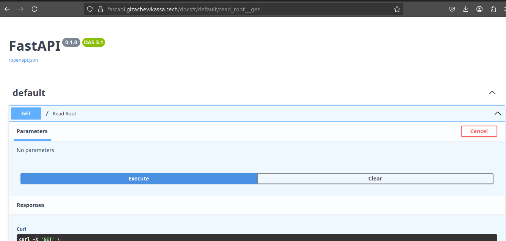

# Azure VM Deployment with FastAPI, NGINX, and Let's Encrypt

This project demonstrates how to provision infrastructure and deploy a secure FastAPI application using **Terraform**, **Ansible**, and **Azure** cloud. It includes:

-  Infrastructure provisioning via Terraform
-  Configuration management with Ansible
-  FastAPI app deployment
-  Reverse proxy setup with NGINX
-  HTTPS support via Let's Encrypt (Certbot)
-  Custom domain with DNS integration

---

## Project Structure

```
azure_vm_nginx/
├── terraform/                 # Infrastructure as Code
│   ├── main.tf
│   ├── variables.tf
│   ├── outputs.tf
│   └── terraform.tfvars       # (gitignored, contains secrets)
├── ansible/                   # Configuration Management
│   ├── hosts.ini
│   ├── fastapi.yml            # Installs Python, FastAPI, sets up systemd service
│   ├── nginx.yml              # Reverse proxy config + HTTPS
│   └── certbot.yml            # LetsEncrypt SSL automation
└── images/                   # Screenshots
    └── screenshot.png         # FastAPI Swagger UI
```

---

## Deployment Flow

### 1. Provision Infrastructure with Terraform
Creates:
- Azure resource group
- Virtual network, subnet
- Public IP
- NSG with ports 22, 80, and 443 open
- Ubuntu VM with SSH key login

```bash
cd terraform
terraform init
terraform apply
```

> Public IP is exported as Terraform output.

---

### 2. Configure the Server with Ansible

Set the public IP in `ansible/hosts.ini`:

```ini
[web]
<YOUR_PUBLIC_IP> ansible_user=azureuser ansible_ssh_private_key_file=~/.ssh/id_rsa
```

#### 2.1 Install and Start FastAPI
```bash
ansible-playbook -i hosts.ini fastapi.yml
```

#### 2.2 Set Up NGINX Reverse Proxy
```bash
ansible-playbook -i hosts.ini nginx.yml
```

#### 2.3 Secure the App with Certbot
```bash
ansible-playbook -i hosts.ini certbot.yml
```

---

## Final Result

This FastAPI app was publicly available at:
```
https://fastapi.gizachewkassa.tech/docs
```

It was deployed temporarily for demonstration purposes and has since been destroyed to avoid unnecessary cloud charges.

Key features included:
- NGINX reverse proxy to FastAPI (localhost:8000)
- HTTPS with automatic redirection from HTTP (port 80 → 443)
- TLS secured via Let's Encrypt (Certbot)

---

## Screenshots



---

## Notes

- Port `8000` is only used internally between NGINX and Uvicorn.
- Certbot uses HTTP-01 challenge, so port 80 must remain open.
- SSH access (port 22) can be restricted to your IP for production hardening.

---

## Teardown (to avoid charges)

```bash
cd terraform
terraform destroy
```
